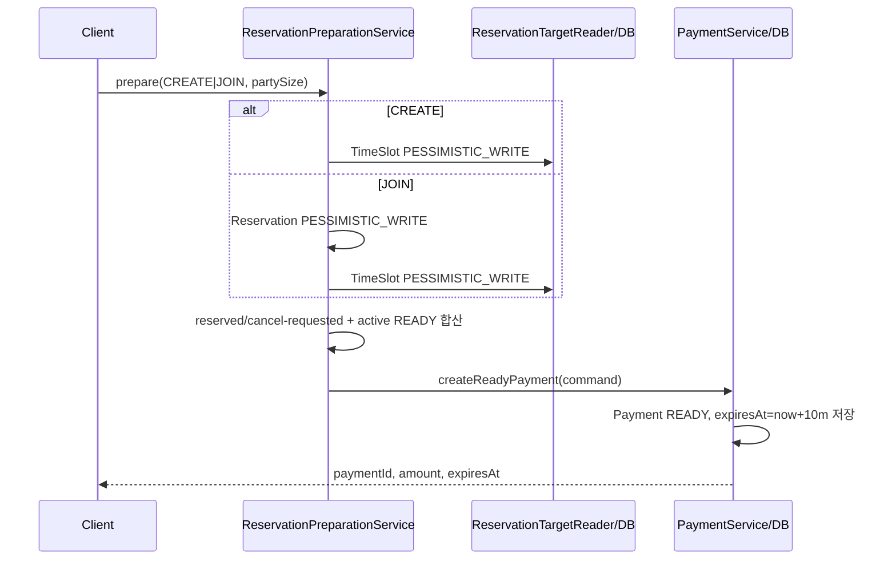
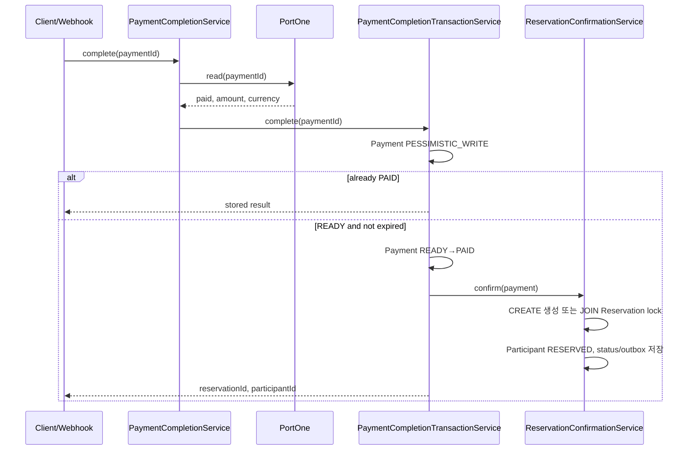
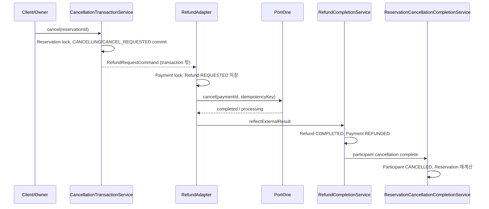
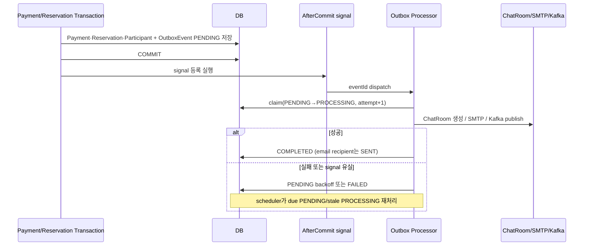

# As-Is 핵심 거래 흐름 역추적

> 대상: Issue #6 / 기준: `src/main/java` 실제 코드
> 범위: 거래 흐름 이해와 Before Evidence 확보만 수행한다. 코드·패키지·트랜잭션·락 규칙을 변경하지 않는다.

## 읽는 기준과 문서 차이

- 아래 내용은 코드에서 확인된 사실이다. 코드로 확인할 수 없는 운영 동작은 **추정하지 않는다**.
- `docs/PROJECT_CONTEXT.md`의 “외부 PG 재조회 → Payment 행 락 → 예약 확정” 설명은 `PaymentCompletionService`와 `PaymentCompletionTransactionService`의 구현과 일치한다.
- 문서의 “AfterCommit만 사용하던 이메일 방식은 프로세스 종료 시 유실 가능” 설명은 현재 `EmailOutboxEventService`/`EmailOutboxProcessor` 구조의 도입 이유다. 이 문서는 과거 구현 자체를 소스에서 재현하지 않았으므로 과거 유실은 **문서 기록**으로만 취급한다.

## 1. 예약 준비

`ReservationPreparationService.prepare`는 CREATE 또는 JOIN 요청을 검증하고, 결제 성공 전에는 `Reservation`/`ReservationParticipant`를 만들지 않는다. `PaymentService.createReadyPayment`이 10분 만료의 `Payment(READY)`를 저장한다.

| 단계 | 클래스/메서드 | 입력 상태 | 수행 작업 | 트랜잭션 | 락 | 외부 I/O | 성공 후 상태 | 실패 시 상태 |
|---|---|---|---|---|---|---|---|---|
| 요청 진입 | `ReservationController.prepare` → `ReservationPreparationService.prepare` | CREATE 또는 JOIN, `partySize` | 입력 크기와 대상 유형 분기 | `@Transactional` | CREATE: TimeSlot 단독 / JOIN: Reservation → TimeSlot | 없음 | 검증 계속 | 예외, DB 변경 없음 |
| 대상 해석 | `resolveCreateTarget` / `resolveJoinTarget` | TimeSlot 또는 Reservation | 식당 보증금·테이블 정원·활성 예약/중복 참여 확인 | 같은 트랜잭션 | JOIN은 `findWithLockById`가 첫 조회 | 없음 | 대상·정원 확보 | DB 변경 없음 |
| 잔여 좌석 | `AvailableCapacityCalculator.calculate` | 테이블 정원 | `정원 - RESERVED/CANCEL_REQUESTED partySize 합 - expiresAt > now READY partySize 합` | 호출 트랜잭션 | 위 TimeSlot/Reservation 락으로 준비 동시성 직렬화 | 없음 | 허용 잔여 좌석 | 부족 시 DB 변경 없음 |
| READY 생성 | `PaymentService.createReadyPayment` | 검증 통과 | UUID paymentId, 금액, `expiresAt=now+10분`으로 저장 | `@Transactional` | 기존 잠금 범위 안에서 실행 | 없음 | `Payment.READY`; CREATE는 reservationId null, JOIN은 기존 reservationId | 저장 실패 시 전체 prepare rollback |
| 만료 정규화 | `PaymentExpirationScheduler` → `PaymentExpirationProcessor.expire` | READY, expiresAt ≤ now | 후보 내부 ID를 조회하고 `expireIfNeeded` | 건별 `@Transactional` | Payment 단독 비관적 락 | 없음 | `EXPIRED` | 후보 한 건 실패만 로그, 다음 후보 계속 |

**동시성 근거:** CREATE는 TimeSlot 잠금 아래 READY까지 만들고, JOIN은 Reservation을 먼저 잠근 뒤 TimeSlot을 잠근다. `ReservationPreparationService`의 주석은 MySQL REPEATABLE_READ에서 JOIN의 잠금 조회가 첫 조회여야 함을 명시한다. 만료 전 READY만 합산하므로 스케줄러가 아직 EXPIRED로 바꾸지 않아도 좌석 계산에서는 즉시 제외된다.

## 2. 결제 완료와 예약 확정

| 단계 | 클래스/메서드 | 입력 상태 | 수행 작업 | 트랜잭션 | 락 | 외부 I/O | 성공 후 상태 | 실패 시 상태 |
|---|---|---|---|---|---|---|---|---|
| HTTP/웹훅 입구 | `PaymentController.complete` / `PortOneWebhookController.receive` | paymentId | 일반 호출은 소유자 확인, 웹훅은 서명 검증 | 없음 | 없음 | 웹훅 SDK 검증 | 다음 단계 | 서명 실패 400 |
| PG 재조회 | `PaymentCompletionService.complete*` | READY/EXPIRED/PAID | paymentId·paid·amount·currency(KRW) 대조 | 트랜잭션 밖 | 없음 | PortOne `read` | 내부 확정 호출 | 불일치 예외, 내부 상태 변경 없음 |
| 멱등 입구 | `PaymentCompletionService` | 이미 PAID | 기존 reservation/participant ID 반환 | 없음 | 없음 | 없음 | PAID 유지 | 해당 없음 |
| 내부 확정 | `PaymentCompletionTransactionService.complete` | READY, 미만료 | Payment `complete`, 예약 확정 Port 호출, ID 연결 | `@Transactional` | Payment → Reservation(JOIN) | 없음 | Payment PAID + 예약/참여 생성/연결 | 예외 시 이 트랜잭션 rollback |
| 예약 반영 | `ReservationConfirmationService.confirm` | Payment PAID (영속성 flush 전) | CREATE: Reservation 생성; JOIN: Reservation 재잠금; Participant 생성; 상태 재계산; outbox 저장 | `MANDATORY` | JOIN Reservation 잠금 | 없음 | Participant RESERVED, Reservation RECRUITING/CONFIRMED, 모집 CLOSED 가능 | 호출 transaction과 함께 rollback |

**중복 콜백:** 첫 확정은 Payment 행 비관적 락으로 직렬화한다. 뒤 호출은 잠금 해제 후 PAID를 보고 기존 결과를 반환한다. `Payment.reservationParticipantId`는 unique 컬럼이기도 하다. 다만 외부 PG가 PAID인데 내부 Payment가 EXPIRED이거나 내부 확정 중 예외가 나면 `PAYMENT_COMPENSATION_REQUIRED`를 로그/메트릭으로 남기고 자동 예약 확정·자동 환불을 하지 않는다.

## 3. 취소와 환불

| 단계 | 클래스/메서드 | 입력 상태 | 수행 작업 | 트랜잭션 | 락 | 외부 I/O | 성공 후 상태 | 실패 시 상태 |
|---|---|---|---|---|---|---|---|---|
| 취소 접수 | `ReservationCancellationTransactionService.accept` | 활성 Reservation, RESERVED participant | 권한·2시간 기한 검증, 대상 participant를 CANCEL_REQUESTED, 전체 취소면 Reservation CANCELLING | `@Transactional` | Reservation 단독 비관적 락 | 없음 | 취소 접수 커밋 | 검증 실패 시 원상태 |
| 환불 요청 생성 | `RefundTransactionService.createRequested` | PAID Payment, Refund 없음 | Payment 잠금, Refund REQUESTED·idempotencyKey 저장 | `REQUIRES_NEW` | Payment 단독 비관적 락 | 없음 | Refund REQUESTED | 이미 진행 중이면 오류, 기존 상태 유지 |
| PG 환불 | `ReservationCancellationRefundAdapter.request` | REQUESTED | PortOne 환불 요청 | 트랜잭션 밖 | 없음 | PortOne cancel | 결과 처리 | 명시적 PG 실패: Refund FAILED; 불명확 실패: REQUESTED 유지 |
| 완료 반영 | `RefundCompletionService.reflectExternalResult` | REQUESTED/PROCESSING | Refund 완료/처리중 반영, Payment REFUNDED, completion Port 호출 | `REQUIRES_NEW` | Refund/Payment 조회 락 | 없음 | Refund COMPLETED, Payment REFUNDED, Participant CANCELLED | 완료 경로 예외면 해당 새 transaction rollback |
| 예약 최종 반영 | `ReservationCancellationCompletionService.complete` | COMPLETED Refund | participant CANCELLED, Reservation 상태 재계산 | 완료 transaction에 참여 | Reservation 관련 잠금 | 없음 | 좌석 반환·예약 CANCELLED/상태 재계산 | 결제/환불 완료 반영도 함께 rollback |
| 재조정 | `RefundReconciliationScheduler` | REQUESTED/PROCESSING, 최소 경과 시간 충족 | PG 조회 후 완료 공통 경로 재사용 | 조회는 트랜잭션 밖, 반영은 위 새 transaction | 반영 시 Refund 락 | PortOne reconcile | COMPLETED 또는 PROCESSING 최신화 | ambiguous/조회 실패는 상태 유지·로그 |

**남는 상태와 복구:** PG 호출 전에/중에 실패하면 이미 접수된 `CANCELLING`/`CANCEL_REQUESTED`는 rollback되지 않는다. 명시적 PG 실패는 `Refund.FAILED`, 응답 불명확은 `REQUESTED`를 남긴다. `REQUESTED`/`PROCESSING`은 reconciliation scheduler가 PortOne 조회로 재확인한다. `FAILED → COMPLETED`는 entity가 자동 전이하지 않으므로, 뒤늦은 웹훅도 상태를 뒤집지 않고 로그를 남긴다.

## 4. 정산은 실제 송금이 아닌 조회

`SettlementQueryService`와 `SettlementController`는 OWNER 소유 식당을 검증한 뒤 지급 **예정** 금액과 예약별 내역을 반환한다. 실제 이체 API, 송금 Gateway, 정산 상태 Entity는 확인하지 못했다.

| 단계 | 클래스/메서드 | 입력 상태 | 수행 작업 | 트랜잭션 | 락 | 외부 I/O | 성공 후 상태 | 실패 시 상태 |
|---|---|---|---|---|---|---|---|---|
| OWNER 검증 | `SettlementQueryService.getExpectedSettlement` | ownerId, restaurantId, 기간 | Restaurant 소유권 확인 | `readOnly` | 없음 | 없음 | 조회 진행 | 접근 거부/없음 |
| 합계 계산 | `PaymentRepository.sumSettlementAmounts` | paidAt 존재 Payment | Payment.amount 합 - COMPLETED Refund.amount 합, TimeSlot 시작 시각 기간 필터 | readOnly | 없음 | 없음 | `ExpectedSettlementResponse` | 조회 오류 |
| 예약 상세 | `getReservationSettlements` / `getReservationSettlement` | 동일 | Restaurant→SharedTable→TimeSlot→Reservation과 Payment/Refund 조회 조합 | readOnly | 없음 | 없음 | 목록/상세 DTO | 없음/접근 거부 |

## 5. Outbox와 후속 처리

| 단계 | 클래스/메서드 | 입력 상태 | 수행 작업 | 트랜잭션 | 락 | 외부 I/O | 성공 후 상태 | 실패 시 상태 |
|---|---|---|---|---|---|---|---|---|
| 거래와 의도 저장 | `ReservationConfirmationService.confirm` | 결제 확정 중 | CREATE ChatRoom event, 이메일 event/delivery를 핵심 transaction에 저장 | `MANDATORY` | 거래의 기존 락 | 없음 | Outbox PENDING | 거래 rollback 시 함께 없음 |
| 메시지 이벤트 저장 | `ChatMessageCommandService.send` | 유효 chat access | ChatMessage + CHAT_MESSAGE_CREATED Outbox 저장 | `@Transactional` | 해당 DB 저장 | 없음 | 메시지·Outbox PENDING | 함께 rollback |
| commit signal | `AfterCommitExecutor.run` | DB commit 성공 | ChatRoom signal, Email dispatcher, Kafka signal 등록 | commit 후 | 없음 | Executor 제출/Redis 등 | 빠른 처리 시도 | signal 실패/유실은 DB PENDING 유지 |
| claim | `OutboxEventTransactionService.claim` | PENDING due event | PROCESSING 전이 및 attempt 증가 | 별도 transaction | Outbox 행 조건부 claim | 없음 | PROCESSING | 다른 processor가 선점하면 미처리 |
| 실제 작업 | 각 Processor | claimed event | ChatRoom createIfAbsent / recipient SMTP / Kafka ACK 대기 | processor별 짧은 transaction 또는 외부 호출 구간 | ChatRoom은 DB UNIQUE, 상태 변경은 Outbox 행 | SMTP, Kafka | COMPLETED 또는 delivery SENT | 실패는 backoff PENDING, 최대 재시도 후 FAILED |
| stale 복구 | `ChatRoomOutboxProcessor` 등 scheduler | 5분 이상 PROCESSING 또는 due PENDING | stale을 PENDING으로 회복하고 재처리 | 상태 service transaction | Outbox 행 | 없음 | 재시도 | 핵심 거래 상태 불변 |

**책임 구분:** `ChatRoomOutboxProcessor`는 ChatRoom 생성, `EmailOutboxProcessor`는 수신자별 SMTP 시도, `ChatMessageOutboxProcessor`는 Kafka broker ACK 뒤 COMPLETED 처리를 담당한다. 이들은 핵심 거래가 커밋된 뒤 실행되므로 실패해도 이미 커밋된 Payment/Reservation/Participant를 rollback하지 않는다. ChatRoom은 `reservation_id` UNIQUE + `createIfAbsent`로 at-least-once 재처리에서 한 건을 유지한다.

## 현승 면접 답변 카드

| 질문 | 코드 근거 답변 |
|---|---|
| 남은 좌석과 동시 요청 | `AvailableCapacityCalculator`가 정원에서 RESERVED/CANCEL_REQUESTED와 만료 전 READY 합을 뺀다. CREATE는 TimeSlot, JOIN은 Reservation→TimeSlot 비관적 락을 잡고 READY를 만든다. |
| 웹훅 중복 확정 | Payment 내부 PK 행을 비관적 잠금으로 직렬화하고, 먼저 완료된 Payment가 PAID이면 기존 reservation/participant 결과를 반환한다. |
| 외부 결제 성공·예약 확정 실패 | PG 재조회 뒤 내부 확정 transaction이 실패하면 `PAYMENT_COMPENSATION_REQUIRED` 로그/메트릭을 남긴다. 코드상 자동 예약 확정·자동 환불은 하지 않는다. |
| 환불 실패와 복구 | 취소 접수 상태는 남는다. 명시적 PG 실패는 Refund FAILED, 불명확 실패는 REQUESTED이며 scheduler가 REQUESTED/PROCESSING을 PG 조회로 reconciliation한다. |
| 외부 PG를 긴 transaction 밖에 두는 이유 | `PaymentCompletionService`는 외부 검증 뒤 짧은 Payment 잠금 transaction으로 위임하고, 취소도 접수 transaction 뒤에 PG를 호출한다. 따라서 DB 락 보유 중 네트워크 I/O를 피한다. |
| Outbox와 AfterCommit | AfterCommit signal은 빠른 경로일 뿐 DB 이벤트가 재처리 근거다. 문서상 과거 메모리 AfterCommit 방식은 프로세스 종료 시 시도 자체를 잃을 수 있어 Outbox로 바뀌었다. |
| ChatRoom/Email 실패 영향 | 생성/발송은 commit 뒤 processor가 수행한다. 실패는 Outbox 재시도/FAILED로 남고 핵심 Payment·Reservation 상태는 이미 커밋돼 유지된다. |
| 정산의 성격 | 실제 송금이 아니라 paid Payment에서 COMPLETED Refund를 뺀 OWNER 지급 예정 금액·내역 조회다. 송금 Gateway나 Settlement Entity는 현재 코드에서 확인하지 못했다. |

## 반드시 외울 규칙과 다음 Issue 입력

### 1. 반드시 외울 핵심 도메인 규칙

- 결제 성공 전에는 Reservation/Participant를 만들지 않고 READY Payment가 10분 임시 선점 역할을 한다.
- `CANCEL_REQUESTED`는 환불 완료 전까지 좌석 점유 상태다.
- Payment 확정의 락 순서는 `Payment → Reservation`, JOIN 준비는 `Reservation → TimeSlot`이며 서로의 구간을 혼동해 역순으로 잡지 않는다.
- 외부 PG 성공과 내부 확정 실패는 자동 보상하지 않고 compensation required로 관찰한다.

### 2. 장애 시 먼저 볼 클래스와 상태

- 결제: `PaymentCompletionService`, `PaymentCompletionTransactionService`, Payment READY/PAID/EXPIRED.
- 환불: `ReservationCancellationTransactionService`, `RefundTransactionService`, Refund REQUESTED/PROCESSING/FAILED/COMPLETED, Payment REFUNDED.
- 후속 처리: `OutboxEventTransactionService`, 각 Processor/Scheduler, Outbox PENDING/PROCESSING/FAILED 및 Email delivery 상태.

### 3. 리팩토링 전에 절대 깨면 안 되는 규칙

- Payment/Reservation 확정과 outbox 의도 저장의 원자성.
- 외부 PortOne 호출을 Payment·Reservation 락 보유 transaction 밖에 두는 경계.
- READY 만료 시각을 좌석 계산에 직접 반영하는 규칙과 Payment expiration의 건별 행 락.
- 취소 접수와 환불 완료를 분리하고, 완료 때만 Participant CANCELLED/좌석 반환을 반영하는 순서.

### 4. Issue #7 책임 소유 후보

- **reservation**: 좌석 계산, 예약/참여 상태, 취소 접수와 완료 후 재계산.
- **payment**: READY/PAID/EXPIRED/REFUNDED, PG 검증·환불·reconciliation.
- **outbox**: 재시도 가능한 후속 작업의 상태 기계와 claim/recovery.
- **adapter/port 경계**: reservation↔payment 완료/환불 계약, PortOne SDK 호출, SMTP/Kafka 구현.

이 후보는 구조 변경안이 아니라 책임 소유를 다시 설계할 때 검증할 출발점이다.
