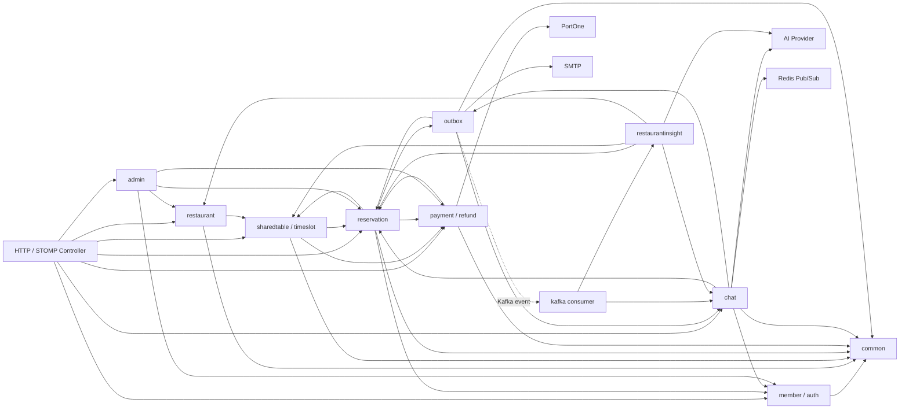

# As-Is 패키지 구조와 도메인 의존 관계 맵

> 대상: Issue #5
> 기준: `src/main/java`의 399개 Java 소스, `analysis/5-as-is-package-structure` 브랜치의 `a3dd401`
> 범위: 현재 구조 관찰과 개선 후보 식별만 수행한다. 패키지·클래스 이동, 의존 역전, 리팩터링은 포함하지 않는다.

## 1. 현재 패키지 구조 요약

프로젝트는 `docs/CODE_CONVENTION.md`가 정한 **기능 단위 최상위 패키지 + 역할별 하위 패키지** 구조다. 기본 흐름은 `controller → service → repository → entity`이며, 외부 시스템 또는 타 도메인 조회가 필요한 일부 지점에는 `port`와 `adapter`를 둔다.

| 최상위 패키지 | 하위 패키지·역할 | 실제 관찰 |
|---|---|---|
| `admin` | controller, service, repository, dto | 관리 화면용 여러 도메인의 조회·통계 projection을 제공한다. |
| `auth` | controller, service, token, dto | 회원 가입·로그인·토큰 재발급/폐기를 다룬다. |
| `chat` | controller, service, repository, entity, port, adapter, realtime, security, config | 채팅방·메시지·신고·AI moderation·STOMP/Redis 실시간 전파를 담당한다. |
| `common` | config, entity, exception, response, security, monitoring, transaction, support | 인프라 공통 요소와 응답/예외/인증을 제공한다. |
| `kafka` | consumer, config, exception, support | chat outbox가 발행한 이벤트를 moderation 및 restaurant insight로 소비한다. |
| `member` | controller, service, repository, entity, dto | 내 정보 조회·수정과 회원 영속 모델을 담당한다. |
| `notification` | adapter | 예약 알림 Port의 SMTP 구현을 제공한다. |
| `outbox` | entity, repository, service, config | 채팅방 생성, 이메일, Kafka 발행의 재시도 가능한 후속 처리를 담당한다. |
| `payment` | controller, service, repository, entity, port, adapter, config, exception, dto | READY/PAID/EXPIRED, PG 검증, 환불, 지급 예정금 조회를 담당한다. |
| `reservation` | controller, service, repository, entity, policy, port, adapter, dto | 예약 준비·확정·참여·취소·노쇼·모집 마감/종료를 담당한다. |
| `restaurant` | controller, service, repository, entity, cache, image | 식당 CRUD·검색 캐시·이미지 업로드 경계를 담당한다. |
| `restaurantinsight` | service, repository, entity, port, adapter, config, dto | 채팅 메시지 기반의 식당 피드백 AI 분석과 OWNER 집계를 담당한다. |
| `sharedtable`, `timeslot` | controller, service, repository, entity, port/adapter, dto | 식당의 합석 테이블과 식사 회차를 관리한다. |

`admin`, `kafka`, `notification`은 독립적인 핵심 상태 모델을 만들기보다 각각 조회 조합, 이벤트 소비, 외부 메일 전송이라는 횡단 역할에 가깝다. `restaurant/image`은 식당 하위 기능이지만 자체 controller/service/port/adapter/config을 가져 작은 하위 모듈처럼 구성돼 있다.

## 2. 도메인별 책임 표

| 도메인 | 핵심 Controller | 핵심 Service | Repository·Entity | 대표 요청/처리 흐름 |
|---|---|---|---|---|
| reservation | `ReservationController`, `OwnerReservationController`, `NoShowController` | `ReservationPreparationService`, `ReservationConfirmationService`, `ReservationCancellationService`, `NoShowService` | `ReservationRepository`, `ReservationParticipantRepository`; `Reservation`, `ReservationParticipant`, `NoShowHistory` | 예약 가능 여부/결제 준비 → 결제 완료 콜백으로 예약·참여 확정. 취소는 접수 후 payment에 환불을 요청한다. |
| payment / refund | `PaymentController`, `PortOneWebhookController`, `RefundController`, `SettlementController` | `PaymentCompletionService`, `PaymentCompletionTransactionService`, `RefundCompletionService`, `RefundTransactionService`, `SettlementQueryService` | `PaymentRepository`, `RefundRepository`; `Payment`, `Refund` | 외부 PortOne 재조회·검증 → 짧은 잠금 트랜잭션 → 예약 확정. 환불 완료 시 예약 참여 취소 완료로 연결한다. |
| restaurant | `RestaurantController`, `OwnerRestaurantController`, `RestaurantImageController` | `RestaurantService`, `RestaurantImageService` | `RestaurantRepository`; `Restaurant` | OWNER 식당 등록/수정/삭제, 일반 검색/상세 조회, S3 이미지 키 검증과 검색 캐시 갱신을 처리한다. |
| chat | `ReservationChatRoomController`, `ChatMessageController`, `ChatMessageQueryController` | `ChatRoomCreationService`, `ChatMessageCommandService`, `ChatMessageQueryService`, `ChatModerationService` | `ChatRoomRepository`, `ChatMessageRepository`, `ChatModerationRepository`; `ChatRoom`, `ChatMessage`, `ChatModeration` | 예약별 방 조회/생성, STOMP 메시지 저장 → outbox 저장 → 커밋 후 Kafka 신호 및 Redis 실시간 전파. |
| restaurantinsight | `OwnerRestaurantController`의 feedback-insights endpoint | `RestaurantFeedbackInsightService`, `RestaurantFeedbackInsightWriter` | `RestaurantFeedbackInsightRepository`, `RestaurantFeedbackItemRepository`; `RestaurantFeedbackInsight`, `RestaurantFeedbackItem` | Kafka가 `ChatMessageCreatedEvent`를 소비 → 메시지와 예약 경로로 식당을 역추적 → AI 분석 결과를 별도 저장 → OWNER 집계 조회. |
| outbox | 직접 HTTP Controller 없음 | `ChatRoomOutboxProcessor`, `ChatMessageOutboxProcessor`, `EmailOutboxProcessor`, `OutboxEventTransactionService` | `OutboxEventRepository`, `EmailOutboxDeliveryRepository`; `OutboxEvent`, `EmailOutboxDelivery` | 핵심 트랜잭션의 outbox를 claim → 별도 후속 작업 → 완료/실패/재시도 상태 갱신. |
| member / auth | `MemberController`, `AuthController` | `MemberService`, `AuthService` | `MemberRepository`; `Member` | 회원 정보 갱신과 가입/로그인/토큰 흐름을 처리한다. 다른 도메인은 회원 식별자 값을 주로 보관한다. |
| sharedtable / timeslot | `SharedTableController`, `DiningSessionController` | `SharedTableService`, `TimeSlotService` | 각 Repository; `SharedTable`, `TimeSlot` | OWNER의 식당 하위 테이블·회차를 관리하고, 삭제/수정 시 예약·READY 결제 존재 여부를 검사한다. |
| admin | `Admin*Controller` | `Admin*QueryService`, `MemberModerationQueryService` | `Admin*Repository`와 여러 도메인의 Repository | 각 도메인 상태를 변경하지 않고 목록·상세·통계를 조합하는 읽기 전용 진입점이다. |

### 주요 흐름의 실제 코드 근거

1. **예약 준비와 결제 확정**: `ReservationPreparationService`는 예약 대상과 잔여 인원을 검증한 뒤 payment의 `ReadyPaymentCreator`로 READY 결제를 만들고([ReservationPreparationService.java](../../src/main/java/com/bobfull/reservation/service/ReservationPreparationService.java#L43), [L78](../../src/main/java/com/bobfull/reservation/service/ReservationPreparationService.java#L78)), `PaymentCompletionService`는 PortOne 결과를 검증한 뒤 transaction service로 넘긴다([PaymentCompletionService.java](../../src/main/java/com/bobfull/payment/service/PaymentCompletionService.java#L37)). payment adapter가 `ReservationConfirmationService`를 호출해 예약과 참여자를 확정한다([ReservationConfirmationAdapter.java](../../src/main/java/com/bobfull/payment/adapter/ReservationConfirmationAdapter.java#L9)).
2. **예약 취소와 환불 완료**: reservation은 `ReservationCancellationRefundPort`로 환불을 요청하며 그 계약은 결제 Repository/Entity를 직접 참조하지 않도록 설명한다([ReservationCancellationRefundPort.java](../../src/main/java/com/bobfull/reservation/port/ReservationCancellationRefundPort.java#L5)). payment의 adapter가 그 Port를 구현하고([ReservationCancellationRefundAdapter.java](../../src/main/java/com/bobfull/payment/adapter/ReservationCancellationRefundAdapter.java#L18)), `RefundCompletionService`는 payment 소유 completion Port를 통해 예약의 최종 참여 취소를 호출한다([RefundCompletionService.java](../../src/main/java/com/bobfull/payment/service/RefundCompletionService.java#L9)).
3. **채팅 메시지와 비동기 후속 처리**: 메시지 service는 채팅 접근 Port로 참여 여부를 확인하고, `ChatMessage`와 `OutboxEvent`를 같은 트랜잭션에서 저장한 뒤 커밋 후 signal과 Redis publish를 등록한다([ChatMessageCommandService.java](../../src/main/java/com/bobfull/chat/service/ChatMessageCommandService.java#L28)). `ChatMessageOutboxProcessor`는 outbox와 chat Repository를 읽어 Kafka로 발행한다([ChatMessageOutboxProcessor.java](../../src/main/java/com/bobfull/outbox/service/ChatMessageOutboxProcessor.java#L24)).
4. **식당 insight**: Kafka consumer는 event version을 검증하고 insight service만 호출한다([RestaurantFeedbackInsightConsumer.java](../../src/main/java/com/bobfull/kafka/consumer/RestaurantFeedbackInsightConsumer.java#L10)). insight service는 `ChatRoom → Reservation → TimeSlot → SharedTable → Restaurant`를 직접 조회해 식당 ID를 계산한다([RestaurantFeedbackInsightService.java](../../src/main/java/com/bobfull/restaurantinsight/service/RestaurantFeedbackInsightService.java#L105)).

## 3. 주요 의존 관계 맵

화살표는 import 및 호출로 확인한 **현재 코드 의존 방향**이다. 이벤트 화살표는 Kafka/Outbox에 의해 비동기 처리되며, 모든 선이 동기 호출 또는 Spring bean 순환을 의미하지는 않는다.

### Service가 타 도메인 Repository를 직접 참조하는 위치

아래는 `src/main/java/**/service/*.java`만 대상으로 한 직접 import 기준이다. query-only 조합과 상태 변경 흐름을 구분하기 위해 전부 나열한다.

| Service | 직접 참조 Repository | 성격 |
|---|---|---|
| `AdminMemberQueryService` | `MemberRepository` | 관리자 회원 조회 |
| `AdminPaymentQueryService`, `AdminRefundQueryService` | `PaymentRepository`, `RefundRepository` | 관리자 결제/환불 조회 |
| `AdminReservationQueryService`, `AdminStatisticsQueryService` | `ReservationRepository`, `ReservationParticipantRepository` | 관리자 예약/통계 조회 |
| `AdminRestaurantQueryService` | `RestaurantRepository` | 관리자 식당 조회 |
| `MemberModerationQueryService` | `MemberRepository` | 관리자 moderation 조회 보강 |
| `AuthService` | `MemberRepository` | 가입·로그인 시 회원 영속 처리 |
| `ChatMessageCommandService` | `OutboxEventRepository` | 메시지 저장과 outbox 저장을 같은 트랜잭션으로 처리 |
| `ChatMessageOutboxProcessor` | `ChatMessageRepository` | Kafka payload 작성 |
| `SettlementQueryService` | reservation, restaurant, sharedtable, timeslot Repository | OWNER 지급 예정금 조회 조합 |
| `NoShowService`, `OwnerReservationQueryService`, `ReservationNotificationService` | member, restaurant, sharedtable, timeslot Repository | 예약의 OWNER/참여자/알림 조회 조합 |
| `ReservationCancellationTransactionService`, `ReservationClosingProcessor` | restaurant/sharedtable/timeslot Repository | 취소·종료 상태 계산 및 검증 |
| `ReservationConfirmationService` | `OutboxEventRepository` | 예약 확정과 ChatRoom/이메일 후속 의도를 함께 저장 |
| `RestaurantFeedbackInsightService` | chat, reservation, restaurant, sharedtable, timeslot Repository | 메시지의 식당 역추적과 OWNER 권한 검증 |
| `SharedTableService` | `RestaurantRepository` | 테이블 등록 시 식당 OWNER 검증 |
| `TimeSlotService` | reservation, restaurant, sharedtable Repository | 회차 수정/삭제 시 소유권·사용 여부 검증 |

## 4. 구조상 어색한 후보와 코드 근거

아래 항목은 결함 확정이나 즉시 리팩터링 제안이 아니다. 변경 시 함께 검토할 책임 경계 후보이다.

| 후보 | 코드 근거 | 관찰 및 위험 |
|---|---|---|
| reservation ↔ payment의 컴파일 패키지 양방향 참조 | reservation은 payment service/DTO를 import한다([ReservationPreparationService.java](../../src/main/java/com/bobfull/reservation/service/ReservationPreparationService.java#L5)); payment adapter는 reservation service를 import한다([ReservationConfirmationAdapter.java](../../src/main/java/com/bobfull/payment/adapter/ReservationConfirmationAdapter.java#L5)). | 실행 시 bean circular dependency라고 단정할 근거는 없다. 다만 두 도메인을 동시에 바꾸는 변경에서 계약 소유자와 테스트 범위가 커질 가능성이 있다. |
| reservation 내부의 직접 Repository 조합 집중 | `NoShowService`는 8개 Repository를 주입한다([NoShowService.java](../../src/main/java/com/bobfull/reservation/service/NoShowService.java#L54)). `OwnerReservationQueryService`, `ReservationNotificationService`도 member/restaurant/table/slot을 직접 조합한다. | 예약이 실행 흐름의 중심이므로 필요한 조합일 수 있다. 그러나 동일한 식당→테이블→회차 탐색과 OWNER 검증이 여러 service에 반복되는지는 다음 Issue에서 비교가 필요하다. |
| restaurantinsight의 다도메인 직접 조회 | 6개 타 도메인 Repository를 field로 받고([RestaurantFeedbackInsightService.java](../../src/main/java/com/bobfull/restaurantinsight/service/RestaurantFeedbackInsightService.java#L37)), 5단계 ID 탐색을 직접 수행한다([L105](../../src/main/java/com/bobfull/restaurantinsight/service/RestaurantFeedbackInsightService.java#L105)). | insight의 입력이 chat event이고 출력이 restaurant 집계라 이 경로는 기능상 자연스럽다. 다만 삭제/soft-delete/데이터 불일치의 오류 계약이 여러 도메인 모델에 묶여 변경 영향이 넓다. |
| chat의 outbox Repository 직접 의존 | `ChatMessageCommandService`가 `OutboxEventRepository`를 직접 주입하여 메시지 저장과 이벤트 저장을 함께 수행한다([ChatMessageCommandService.java](../../src/main/java/com/bobfull/chat/service/ChatMessageCommandService.java#L18)). | 같은 DB 트랜잭션이라는 outbox 불변식을 코드에서 명확히 보장한다는 장점이 있다. 반면 chat command가 outbox entity/repository 상세를 알아야 한다. |
| outbox processor의 도메인 service 직접 호출 | `ChatRoomOutboxProcessor`는 `ChatRoomCreationService`를 직접 호출한다([ChatRoomOutboxProcessor.java](../../src/main/java/com/bobfull/outbox/service/ChatRoomOutboxProcessor.java#L25)); Email processor도 reservation notification service를 직접 참조한다. | event type별 처리를 명시적으로 확인하기 쉽다. event 종류가 증가하면 outbox가 여러 도메인의 orchestration 위치가 될 수 있어 processor 등록 방식과 소유권을 점검할 후보다. |
| restaurant controller의 insight service 직접 주입 | `OwnerRestaurantController`가 `RestaurantService`와 `RestaurantFeedbackInsightService`를 함께 주입한다([OwnerRestaurantController.java](../../src/main/java/com/bobfull/restaurant/controller/OwnerRestaurantController.java#L31)). | URL이 식당 OWNER 리소스이므로 API 표면은 자연스럽다. 다만 controller 패키지와 application service 소유 도메인이 다르므로 endpoint ownership을 명시할 필요가 있다. |
| common의 도메인 사건 enum | `BusinessMetricEvent`가 PAYMENT, REFUND, RESERVATION, CHAT, INSIGHT 사건 이름을 모두 가진다([BusinessMetricEvent.java](../../src/main/java/com/bobfull/common/monitoring/BusinessMetricEvent.java#L7)). | recorder 자체는 공통 인프라이고 비즈니스 규칙을 실행하지 않는다. 다만 사건 종류 추가가 `common` 변경을 요구하므로 공통 패키지가 도메인 용어의 집합소가 되는지 관찰할 필요가 있다. |

### common 패키지의 비즈니스 로직 혼재 여부

`common`에서 **상태 전이, Repository 호출, 특정 도메인 유스케이스 orchestration**은 확인하지 못했다. `AfterCommitExecutor`는 트랜잭션 콜백 등록만 수행하고([AfterCommitExecutor.java](../../src/main/java/com/bobfull/common/transaction/AfterCommitExecutor.java#L11)), `BusinessMetricRecorder`는 Micrometer counter 기록 실패를 격리한다([BusinessMetricRecorder.java](../../src/main/java/com/bobfull/common/monitoring/BusinessMetricRecorder.java#L30)).

다만 `BusinessMetricEvent`에는 각 도메인의 운영 사건 이름이 모여 있고, `GlobalExceptionHandler`는 PortOne webhook URI를 별도 분기해 전용 메트릭을 기록한다([GlobalExceptionHandler.java](../../src/main/java/com/bobfull/common/exception/GlobalExceptionHandler.java#L66)). 현재는 공통 오류·관측 정책으로 해석할 수 있으나, 도메인별 재시도나 상태 판단까지 이 위치에 추가되면 `common`의 책임이 커지는지 다시 확인해야 한다.

### 순환 의존 가능성 판정

- **확인됨 — 패키지 import 수준**: `reservation → payment`와 `payment → reservation`의 상호 참조가 있다. 위 payment adapter와 reservation preparation/port 계약이 근거다.
- **확인됨 — chat/outbox 패키지 import 수준**: chat command는 outbox Repository/dispatcher를, outbox processor는 chat Repository/service를 각각 import한다([ChatMessageCommandService.java](../../src/main/java/com/bobfull/chat/service/ChatMessageCommandService.java#L10), [ChatRoomOutboxProcessor.java](../../src/main/java/com/bobfull/outbox/service/ChatRoomOutboxProcessor.java#L3)).
- **미확인 — Spring bean 순환**: 이 분석은 import와 생성자 주입 관계를 확인했으며 애플리케이션 컨텍스트 기동으로 bean cycle을 재현하지 않았다. 패키지 양방향 참조만으로 런타임 순환 주입이라고 결론 내릴 수 없다.

## 5. 유지할 만한 좋은 경계

| 경계 | 유지할 이유와 근거 |
|---|---|
| payment의 PortOne Port | `PortOnePaymentReader`, `PortOneRefundRequester`, `PortOneWebhookVerifier`가 SDK 응답을 payment가 필요한 최소 계약으로 제한한다([PortOneRefundRequester.java](../../src/main/java/com/bobfull/payment/port/PortOneRefundRequester.java#L6)). |
| reservation의 취소 outbound Port | 예약은 payment Entity/Repository 대신 `ReservationCancellationRefundPort`를 통해 환불을 요청한다([ReservationCancellationRefundPort.java](../../src/main/java/com/bobfull/reservation/port/ReservationCancellationRefundPort.java#L5)). |
| chat의 외부 읽기 경계 | `MemberNameReader`와 `ReservationChatAccessReader`를 chat이 소유하고 adapter가 member/reservation Repository를 구현한다([MemberNameReaderAdapter.java](../../src/main/java/com/bobfull/chat/adapter/MemberNameReaderAdapter.java#L8), [ReservationChatAccessAdapter.java](../../src/main/java/com/bobfull/chat/adapter/ReservationChatAccessAdapter.java#L8)). |
| reservation의 target/capacity Reader | 예약 준비/확정 service는 `ReservationTargetReader`·`ReservationCapacityReader`만 알고, 외부 테이블·회차·식당 조회는 adapter에 모여 있다([ReservationTargetReaderAdapter.java](../../src/main/java/com/bobfull/reservation/adapter/ReservationTargetReaderAdapter.java#L15)). |
| ChatRoom 생성의 비동기 멱등 경계 | outbox processor가 핵심 결제/예약 트랜잭션 뒤에 `createIfAbsent`를 호출하고, chat service는 `REQUIRES_NEW`와 UNIQUE 위반 재조회로 멱등 생성을 처리한다([ChatRoomOutboxProcessor.java](../../src/main/java/com/bobfull/outbox/service/ChatRoomOutboxProcessor.java#L67), [ChatRoomCreationService.java](../../src/main/java/com/bobfull/chat/service/ChatRoomCreationService.java#L24)). |
| common의 기술 공통 기능 | `AfterCommitExecutor`는 트랜잭션 커밋 뒤 실행이라는 기술적 관심사만 제공하고([AfterCommitExecutor.java](../../src/main/java/com/bobfull/common/transaction/AfterCommitExecutor.java#L6)), `MemberNameMasker`도 개인정보 표시 규칙을 재사용한다([MemberNameMasker.java](../../src/main/java/com/bobfull/common/support/MemberNameMasker.java#L3)). 이들은 현재 비즈니스 orchestration을 수행하지 않는다. |

## 6. 다음 Issue에서 검토할 개선 후보

우선순위나 구현 방식은 아직 결정하지 않는다. 각 후보는 현재 관찰을 검증할 별도 Issue의 입력으로만 사용한다.

1. **reservation/payment 양방향 참조의 계약 소유권 점검**: READY 생성, 결제 확정, 취소·환불 완료의 세 경로별로 Port의 소유 패키지와 adapter 위치가 일관적인지 확인한다. 상태 전이·락 순서·트랜잭션을 바꾸지 않는 분석부터 시작한다.
2. **예약 조회 조합의 중복 및 읽기 모델 조사**: `OwnerReservationQueryService`, `NoShowService`, `ReservationNotificationService`에 흩어진 member/restaurant/table/slot 탐색이 실제로 중복되는지, 단일 조회 projection으로 줄일 수 있는지 측정한다.
3. **restaurantinsight의 식당 역추적 경로 명시화**: chat event에서 restaurant ID까지의 조회 계약, soft-delete·누락 데이터의 처리 규칙, 테스트 fixture 범위를 정리한다. 별도 Reader/조회 모델이 필요한지는 이 근거 뒤에 판단한다.
4. **outbox event 처리 책임의 확장성 검토**: event type별 processor가 domain service를 직접 호출하는 현 구조에서, event 추가 시 coupling이 실제 문제인지 확인한다. 신뢰성·재시도 정책은 바꾸지 않는다.
5. **`common.monitoring.BusinessMetricEvent`의 소유 전략 검토**: 도메인별 metric event 증가가 공통 변경 충돌을 만드는지 Git 이력과 추가 사건 수로 확인한다. recorder를 분리하거나 event를 이동한다는 결정은 포함하지 않는다.
6. **admin/settlement 같은 cross-domain read service의 조회 경계 분리 검토**: 상태를 변경하지 않는 projection service의 다도메인 Repository 접근을 유지할지, query 전용 Repository를 둘지 API 응답과 성능 근거로 판단한다.

## 분석 한계

- 이 문서는 `src/main/java`의 정적 import, 클래스 책임, 호출 흐름을 기준으로 한다. `src/test/java`의 fixture/테스트 의존성, 실제 DB 쿼리 수, 운영 배포 환경은 구조 결론의 근거로 사용하지 않았다.
- `@ConditionalOnProperty`, `ObjectProvider`, 비동기 Kafka/Redis 경로 때문에 정적 import만으로 실제 실행되는 모든 bean 조합을 확정할 수 없다.
- 따라서 후보는 구조 개선의 승인이나 설계 결론이 아니라, 다음 Issue의 재현·계약·테스트 범위를 정하기 위한 관찰 결과다.
